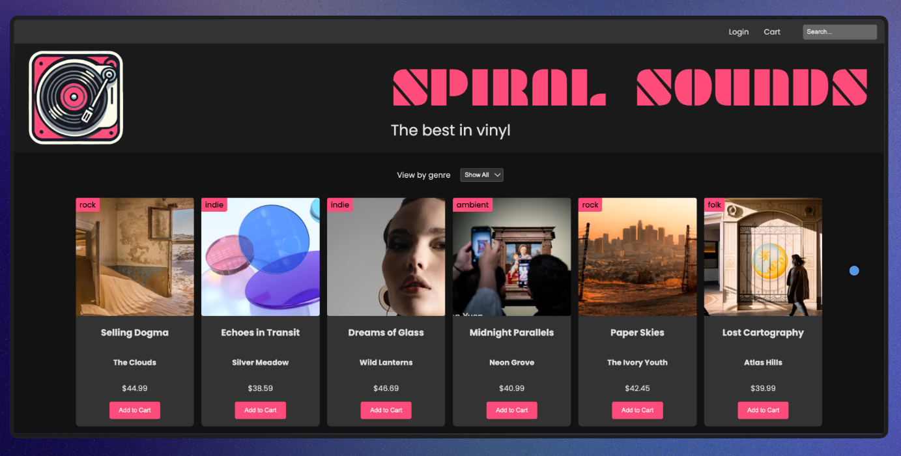

# Spiral Sounds 🎶

Online vinyl store built as a full-stack learning project with Node.js and Express.

## About the project
Spiral Sounds is a simple web application that displays vinyl records, allows filtering by genre and searching by title, artist or genre.  
The project was created mainly for **learning purposes**, to understand how backend logic connects with a frontend interface.

## What I learned
During this project I practiced and learned:

- **Middleware** in Express
- **Serving static files** (HTML, CSS, images)
- **Creating a database**
- **Seeding a database** with initial data
- **Retrieving data from a database**
- **SQL queries and parameter binding**
- Building API endpoints with **Express**
- Handling **query parameters** (`genre`, `search`)
- Basic error handling in backend applications

## Tech stack
- Node.js
- Express
- SQLite
- SQL
- JavaScript (ES modules)

## Features
- Display all vinyl products on page load
- Filter products by genre
- Search products by title, artist, or genre
- Simple REST API for products and genres

## Project purpose
This project was built as part of my learning path to better understand:
- backend fundamentals,
- database interaction,
- and how frontend communicates with an API.

It is **not intended as a production-ready application**, but as a solid educational exercise.

